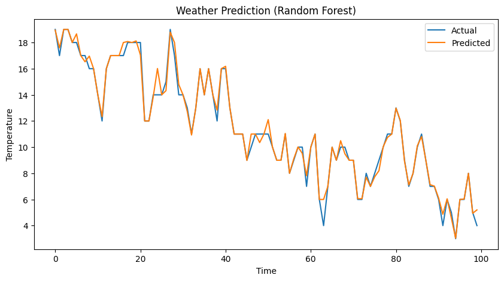
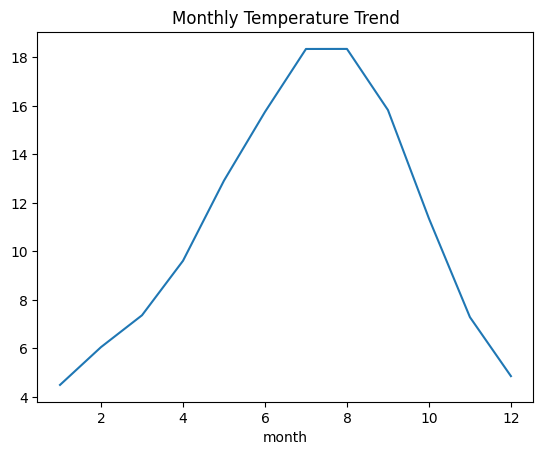

# 🌦 Weather Prediction using Machine Learning

## 📌 Overview
This project predicts temperature using machine learning models based on historical weather data.

## ⚙️ Tech Stack
- Python
- Pandas, NumPy
- Scikit-learn
- Matplotlib

## 📊 Workflow
1. Data Cleaning & Preprocessing  
2. Feature Engineering (month, day extraction)  
3. Model Training  
4. Evaluation (MAE)  
5. Visualization  

## 🤖 Models Used
- Linear Regression  
- Random Forest Regressor  

## 📈 Key Insights
- Temperature shows strong seasonal trends  
- Peak temperatures occur mid-year (summer months)  
- Random Forest improved prediction accuracy compared to Linear Regression  

---

## 📷 Results

### 🔹 Actual vs Predicted

### 🔹 Monthly Temperature Trend

